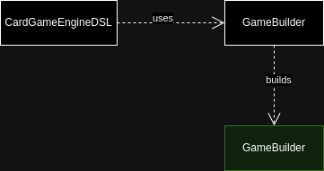
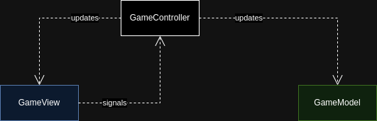

# Architectural Design

- [DSL](#dsl)
- [Engine](#engine)
  - [GameModel](#gamemodel)
  - [GameView](#gameview)
  - [GameController](#gamecontroller)

The project can be divided into two main parts:

- **DSL**: Handles the Domain Specific Language's custom syntax and changes the internal model state. It enables the user to define the rules of the card game.
- **Engine**: Enables the user to play the defined game. It is structured following the Model-View-Controller pattern:
  - **Model**: Manages the data of the Engine. It responds to requests for information and updates the data when instructed.
  - **View**: Manages the GUI and displayes the data from the model to the user. It updates when data in the Model changes and sends user actions to the Controller.
  - **Controller**: Acts as an intermediary, handling input from the View and updating the Model. It manages the flow between the View and Model, ensuring the right data and responses are presented to the user.

The user defined rules for the game are stored entirely in the Model, while the Controller and View are constant for every game iteration. This ensures that the View and Model have no dependency and updates to one of them would only require implementation of new features to them selves or at most the Controller.

TODO add simple uml of the project.

## DSL

The DSL provides a Domain Specific Language to enable the user to define a card game using domain terminology.

The game being defined is then created using the Engine and run, allowing the user to play the card game.

The DSL uses a builder pattern to create a model that is then passed to the controller, which starts the game.

High level UML diagram of the dsl architecture.

## Engine

High level UML diagram of the game engine architecture.

### GameModel

The Model defines the data rappresentation for every main concept in the game.

It is queried by the Controller when data is needed and it is updated to reflect changes to the data requested by the Controller.

### GameView

The View defines the GUI that displays the model contents to the user and allowes the players to interact with the game.

A tecnology must be choosen during detailed design for the GUI implementation.

### GameController

The Controller is an intermidiary between the Model and the View.

It defines the flow of the game extracting the rules defined by the user from the Model and using the View to display the current game state.

[Back to index](../index.md) |
[Previous Chapter](../3_requirements/index.md) |
[Next Chapter](../5_detailed_design/index.md)
