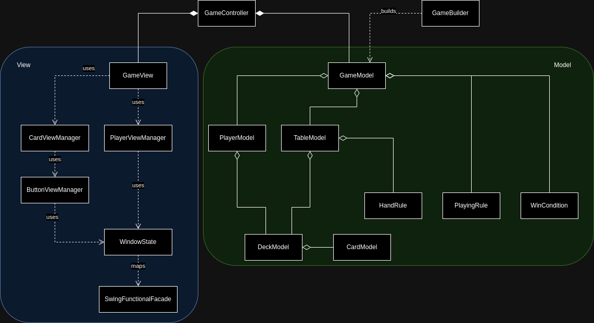

# Detailed Design

- [DSL](#dsl)
- [Engine](#engine)
  - [GameModel](#gamemodel)
  - [GameView](#gameview)
  - [GameController](#gamecontroller)
  - [GameBuilder](#gamebuilder)

## DSL

The main goal of the DSL part is to let the user specify parameters and settings,
and to prepare a `GameBuilder` with them.

The following UML diagram illustrates the main architecture of the DSL part.

`CardGameEngineDSL` represents the entry point for every DSL sentence: using
some pre-defined *words* from `SyntacticSugar` and providing specific builders
to lock sentences syntax, it is possible to create a chain of commands changing
the builder's internal state. The implementation phase is developed as a direct
extension of the design section: each element defined here serves as a clear
guide for implementation.

## Engine

Java Swing is used as technology for the view implementation.

Below the UML diagram of the engine.

### GameModel

The Model defines the following concepts:

- `CardModel` : rappresents a card in the game.
- `DeckModel` : rappresents a collection of `CardModel`.
- `TableModel` : rappresents the table, where cards are placed once played, and the rules for winning a given hand.
- `PlayerModel` : rappresents a single player.
- `HandRule` : defines a rule for winning hand in the game.
- `PlayingRule` : defines a rule for what cards can be played at a given model state.
- `WinCondition` : defines a rule for how the winners of the game are selected.

### GameView

The View is made functional using a State Pattern.

The `SwingFunctionalFacade` is mapped by `WindowState` to expose the Swing GUI methods in a functional manner.

The `CardViewManager` and `PlayerViewManager` objects provide functions for adding a player to the GUI and adding and removing cards from the GUI respectively.

The cards are rappresented as buttons in the GUI so the `CardViewManger` uses a `ButtonViewManager`.

### GameController

The Controller takes a prebuilt Model of the game and creates an initial State to be run as a sequence of updates that generate the initial View.

The Controller then defines the State updates depending on the events published by the View (aka the user interaction).

As a final step the Controller runs the composed State of the View.

On events being published by the View the Controller updates the model accordingly and then updates the State of the View.

### GameBuilder

The Builder takes the various game parameters and then builds the correct initial Model accordingly.

[Back to index](../index.md) |
[Previous Chapter](../4_architectural_design/index.md) |
[Next Chapter](../6_implementation/index.md)
