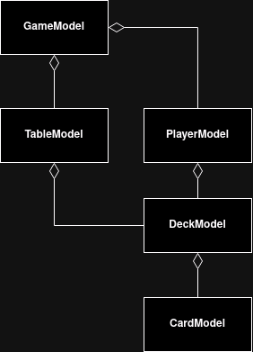
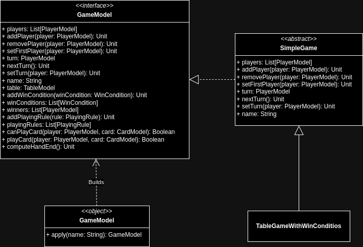

# Andrea Biagini

In the project implementation, I contributed working on `GameModel` and its related objects inside the Model part.

## GameModel

The structure of a GameModel mainy adheres to the object oriented paradigm: it contains all the necessary information related to a card game. A more functional structure can be seen in the implementation of `WinCondition`s, `HandRule`s and `PlayingRule`s.

The following diagram express relations between the elements composing `GameModel`.



Each element of the game model part is implemented hiding different implementations and trying to separate simplet concepts from the more advanced ones. Here is the UML class diagram of `GameModel`, which has a structure analogous to `TableModel`, `PlayerModel`, `DeckModel`, and `CardModel`.



## WinCondition, HandRule and PlayingRule

The implementations of `WinCondition`, `HandRule`, and `PlayingRule` are based on the same idea of using lambdas: each of these names is a type alias for a lambda that takes various objects as arguments, which might be necessary to define the rules.

With `WinCondition`, a win condition for the game can be expressed based on the entire game model and the player for whom we want to check for a win. The lambda is structured as follows:
```scala
(GameModel, PlayerModel) => Boolean
```
and returns `true` if the specified player is the winner of the game, `false` otherwise.

With `HandRule`, a rule can be expressed to determine if a player wins a hand based on the cards on the table, the card that the specified player has played, the trump suit of the game, and the ordered list of ranks in the deck being used. The lambda is structured as follows:
```scala
(List[CardModel], CardModel, Option[Suit], List[Rank]) => Boolean
```
and returns `true` if the specified card is the winner of the current hand, `false` otherwise.

With `PlayingRule`, it’s possible to specify a rule that determines whether a player is allowed to play a certain card based on the current state of the table, the current player, and the card they intend to play. The lambda is structured as follows:
```scala
(TableModel, PlayerModel, CardModel) => Boolean
```
and returns `true` if the specified player is permitted to play the specified card, `false` otherwise.

[Back to index](../../index.md) |
[Back to implementation](../index.md)
