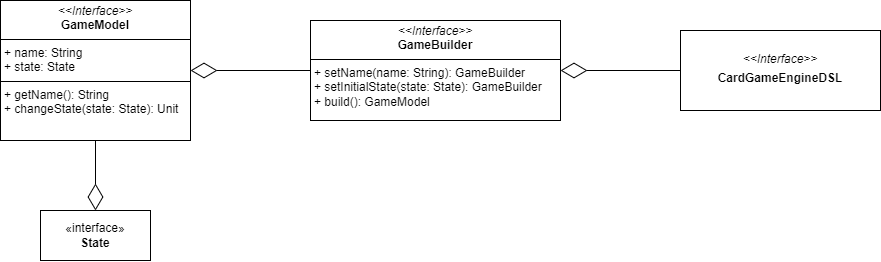
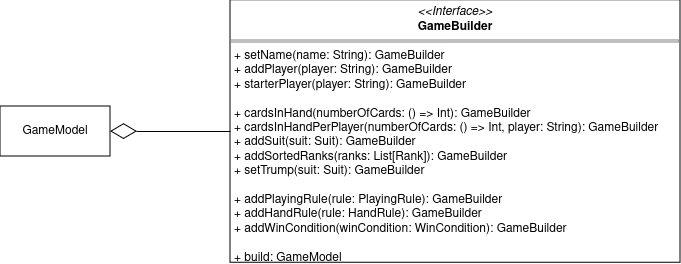
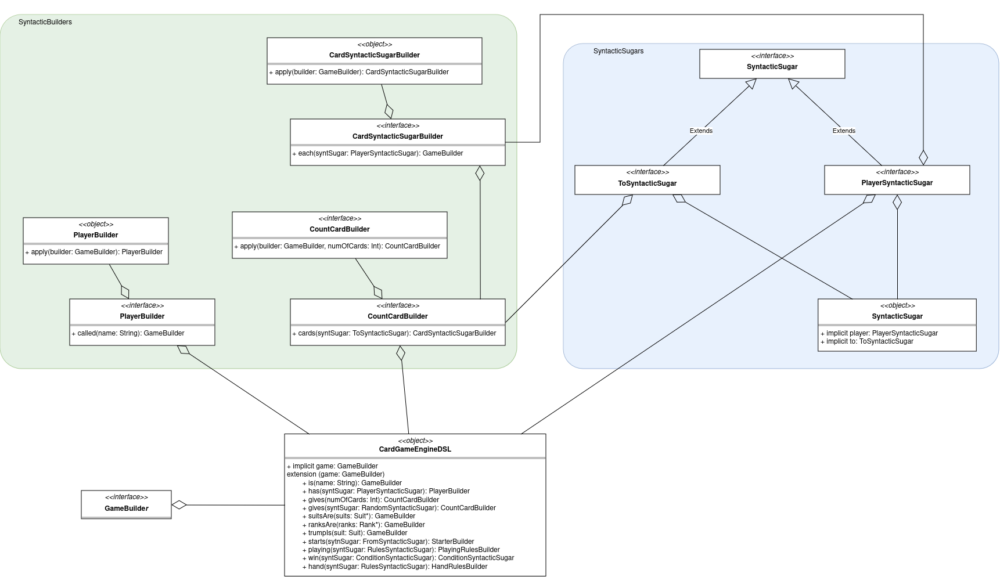

# Filippo Gurioli

## Overview

My work focuses on implementing a Domain-Specific Language (DSL) that allows users to naturally express the definitions, rules, and behaviors of a card game.

## Design

Based on the fact that the model includes a `GameModel`, which is a data structure containing all the necessary information to define a card game, the DSL must essentially act as a builder for this class. A builder is an object capable of incrementally constructing another class, in this case, `GameModel`.

Given the complexity of this task, the work has been divided into two parts:

- `GameBuilder`: The actual builder that encapsulates the logic to construct a `GameModel`.
- `CardGameEngineDSL`: Extension methods for `GameBuilder` that utilize the fluent interface pattern and other techniques to create human-readable sentences.

Below is an initial schematic:



### GameBuilder

The `GameBuilder` class is capable of creating a consistent and ready-to-use instance of the `GameModel`. Following the guidelines of the builder pattern, functionalities were designed to be as simple as possible, allowing the `GameModel` to be customized piece by piece.

For this reason, the methods shown in the following UML diagram were created.



Important design notes:

- It is common for card games to deal the same number of cards to players, so the `cardsInHand` method was created to do just that.
- To avoid the complexity of defining an order among cards, it was decided to require pre-ordered ranks, explicitly addressed by the `addOrderedRanks` method.

### CardGameEngineDSL

The design of the Domain-Specific Language (DSL) differs from the classic design associated with a class diagram. In this case, the design focused more on how to write certain sentences rather than how to organize methods and relationships between classes. The DSL does not have a mutable state; instead, it parses the expressed sentences and translates them into commands for the underlying builder.

Here is an example sentence from which the DSL keywords were derived:

```scala
game is "Simple Game"
game has player called "Filippo"
game has player called "Andrea"
game has player called "Leonardo"
game gives 10 cards to each player
game starts from player "Filippo"
game suitsAre ("Bastoni", "Denari", "Spade", "Coppe")
game ranksAre ("Asso", "2", "3", "4", "5", "6", "7", "Fante", "Cavallo", "Re")
game trumpIs "Bastoni"
```

Important design notes include:

- To enable the DSL to access the `GameBuilder`, its methods are defined as extension methods of the builder.
- As extension methods of the builder, the first word of each DSL sentence must return the `GameBuilder`.
- To use infix notation and allow method calls without parentheses, methods must accept exactly one input parameter.
- The fluent interface pattern is used to enforce correct syntax.
- To satisfy the requirement of having exactly one input parameter for each method, objects were created to continue sentences.

Following these analyses, the DSL was designed as follows:



The diagram represents only the classes that form the sentences `game is "Simple Game"`, `game has player called "Filippo"`, and `game gives 5 cards to each player`. Subsequent sentences follow the same logic and are omitted for brevity and clarity.

For example, to form the sentence `game gives 5 cards to each player`, the user will execute the following calls:

- `game`: An implicit method within the DSL that returns the `GameBuilder`.
- `gives`: An extension method defined by the DSL for `GameBuilder` that returns a `CountCardBuilder`.
- `5`: The parameter for the `gives` method.
- `cards`: The only method of `CountCardBuilder` that returns a `CardSyntacticSugarBuilder` (while also setting the number of cards in the builder).
- `to`: An implicit value defined in the `SyntacticSugar` object and required parameter for the `cards` method.
- `each`: The only method of `CardSyntacticSugarBuilder` that returns the `GameBuilder`.
- `player`: An implicit value defined in the `SyntacticSugar` object and required parameter for the `each` method.

## Conclusion

I believe the next sprint will involve refactoring the game builder to break it into smaller parts. Consequently, since the DSL maps to the builder, a similar solution would be applied to it as well.

[Back to index](../../index.md) |
[Back to implementation](./index.md)
