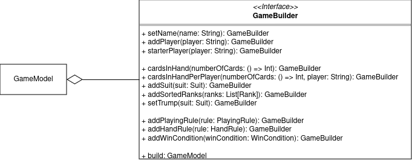

# Filippo Gurioli

## Overview

Il mio lavoro si concentra sull'implementare il DSL in modo che l'utente possa esprimere in linguaggio naturale definizioni, regole e comportamenti di un gioco di carte.

## Design

Partendo dal fatto che il model prevede un `GameModel`, ovvero una struttura dati che contiene tutte le informazioni necessarie per definire un gioco di carte, il DSL deve di fatto rappresentare un _builder_ per questa classe. Per builder si intende un oggetto in grado di costruire un'altra classe, in questo caso `GameModel`, in modo incrementale.

Essendo la sfida non banale si è deciso di suddividere il lavoro in due parti:

- `GameBuilder`: il vero e proprio builder che incapsula la logica per costruire un `GameModel`;
- `CardGameEngineDSL`: _extension methods_ per `GameBuilder` che sfruttano il _fluent interface pattern_ e altri espedienti per creare frasi in linguaggio umano.

Un primo schema di massima viene riportato di seguito:


### GameBuilder

Il `GameBuilder` è la classe in grado di creare una istanza del GameModel coerente e pronta all'uso.

Seguendo le linee guida del _builder pattern_ si sono costruite funzionalità che fossero il più semplici possibile potendo customizzare il GameModel un tassello alla volta.

Per questo motivo sono stati stilati i metodi riportati nell'UML seguente.



Note importanti fatte a livello di design sono:

- è molto frequente che giochi di carte distribuiscano lo stesso numero di carte ai giocatori per questo motivo si è creato il metodo `cardsInHand` che fa esattamente questo.
- per evitare la difficoltà di definire un ordinamento tra le carte, si è deciso di richiedere i _rank_ già ordinati, esplicitando questa cosa con il metodo `addOrderedRanks`.

### CardGameEngineDSL

Il design del Domain Specific Language si differenzia dal classico design associato ad un diagramma delle classi. In questo caso il design si è concentrato maggiormente sul come scrivere certe frasi piuttosto che sul come organizzare metodi e relazioni tra le classi.

Il DSL non ha infatti stato modificabile, quello che fa è fare _parsing_ delle frasi espresse traducendole in comandi per il builder sottostante.

Si lascia quindi una frase d'esempio da cui si sono stilate le parole chiave del DSL.

```scala
game is "Simple Game"
game has player called "Filippo"
game has player called "Andrea"
game has player called "Leonardo"
game gives 10 cards to each player
game starts from player "Filippo"
game suitsAre ("Bastoni", "Denari", "Spade", "Coppe")
game ranksAre ("Asso", "2", "3", "4", "5", "6", "7", "Fante", "Cavallo", "Re")
game trumpIs "Bastoni"
```

Note importanti fatte a livello di design sono:

- affinchè il DSL potesse accedere al `GameBuilder` si è deciso di definire i suoi metodi come _extension methods_ del builder;
- essendo _extension methods_ del builder, la prima parola di ogni frase del DSL deve poter restituire il `GameBuilder`;
- affinchè si possa usare la notazione infissa e fare chiamate a metodo senza la necessità dell'utilizzo di parentesi è necessario che i metodi abbiano esattamente un parametro in input;
- al fine di forzare la corretta sintassi si è utilizzato il _fluent interface pattern_;
- per sopperire alla necessità di avere sempre un parametro in input per ogni metodo, si sono costruiti degli `object` che potessero essere passsati per poter continuare le frasi.

Dopo queste analisi si è quindi stilato il dsl come segue:


Nel diagramma sono state rappresentate solo le classi che permettono di formare le frasi `game is "Simple Game"`, `game has player called "Filippo"` e `game gives 5 cards to each player`. Tutte le frasi successive seguono la stessa logica per cui si è deciso volontariamente di ometterle per brevità e chiarezza dello schema.

[Back to index](../../index.md) |
[Back to implementation](../index.md)
