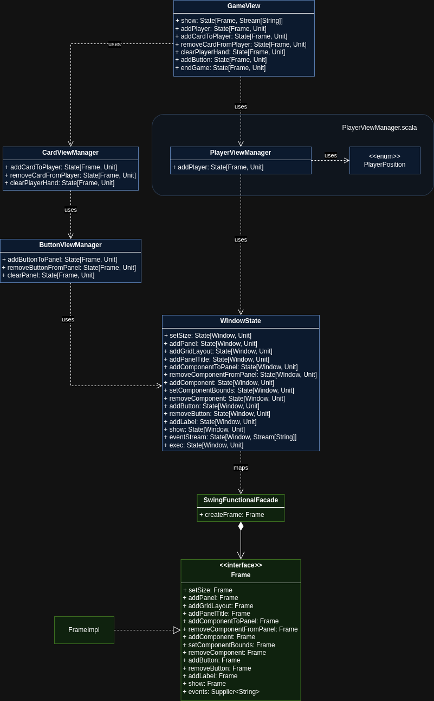

# Leonardo Randacio

I have worked indipendently on the View portion of the Engine.

The following is a detaild uml class diagram of the View:



Classes are colored based on the language used for implementation:

- blue : scala 3
- green : java 21

To implement the View using functional programming the State pattern is used.

## State Pattern

The State implementation and it's dependencies are present in the `engine/view/monads` directory.

## Facade

To use the Java Swing library a `SwingFunctionalFacade` is implemented.

To limit the volume of Java code necessary the facade implements only basic atomic methods that are then used by the scala view portion of the project.

## WindowState

The `WindowState` maps one-to-one all the methods of the java facade into State updates.

It also defines a `Window` type alias that simply replaces the `Frame` type, native to Java Swing.

This object removes the possible dependency from the specific Java GUI library being used.

## GameView

The `GameView` singleton defines high level methods that the Controller can use to generate updates to the View's State.

Every method returns a `State[Window, Unit]` so that it may be called by the Controller as part of a `for-yield` construct to compose the initial state of the View.

## CardView

The cards are rappresented in the GUI using buttons.

If a card button is pressed it triggers an event structured as follows:

```scala
"<playerName>:<rank> <suit>"
```

Where:

- \<playerName\> is the name of the player that has that card in it's hand;
- \<rank\> is the rank of the card;
- \<suit\> is the suit of the card.

## ButtonView

The `clearPanel` method uses the List.foldLeft() method to build a state update composed by states removing one-by-one very button present in the given panel.

A `val unitState(): State[Window, Unit]` is defined that rappresents a state that keeps track of the current window but does not apply any update to it, in other words it is a state that "does nothing".

```scala
  def clearPanel(panelName: String): State[Window, Unit] =
    panelButtons.get(panelName) match
      case Some(buttons) =>
        panelButtons = panelButtons - panelName

        // Using List.foldLeft().
        buttons.foldLeft(unitState()): (acc, button) =>
          // Removing every button, prepending the state obtained by the previous button removal.
          for
            _ <- acc
            _ <- WindowState.removeComponentFromPanel(panelName, button)
            _ <- WindowState.removeButton(button)
          yield ()

      case None => unitState()
```

[Back to index](../../index.md) |
[Back to implementation](./index.md)
